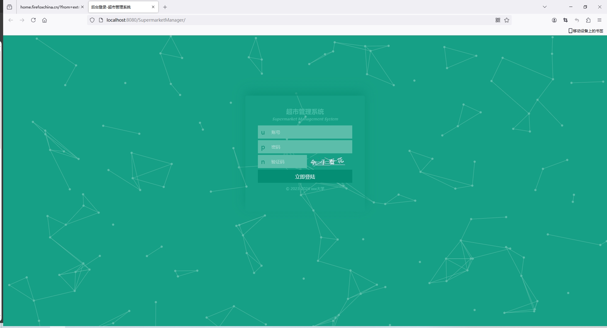
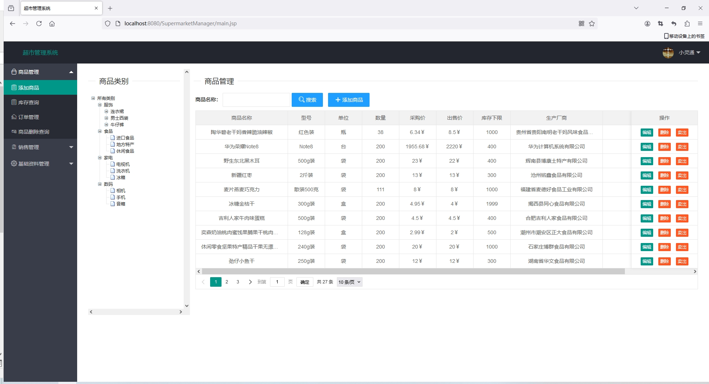
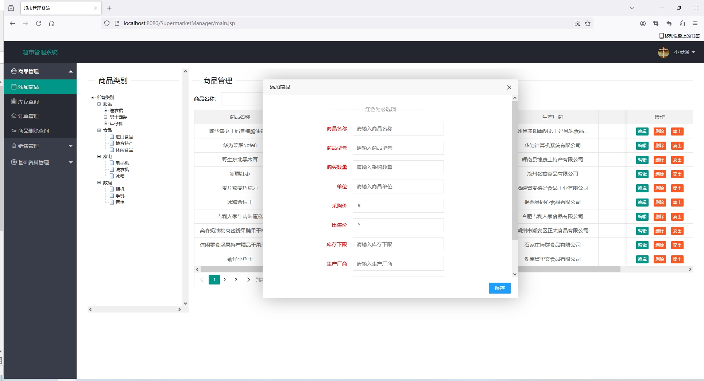
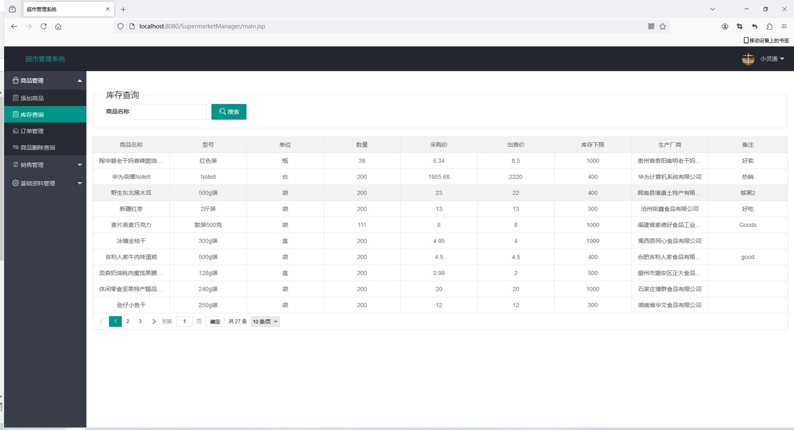
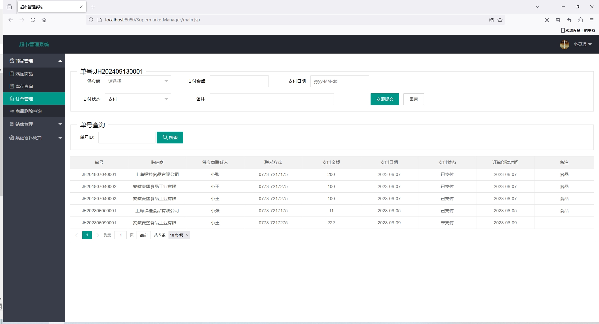
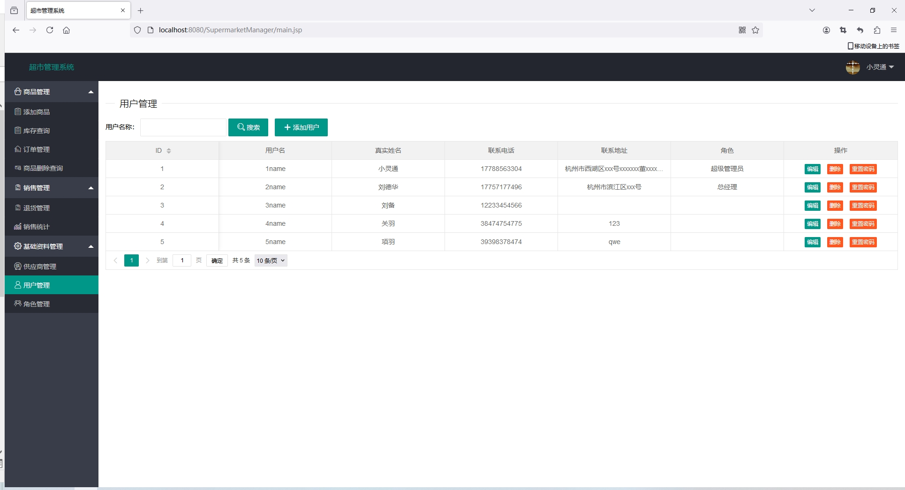
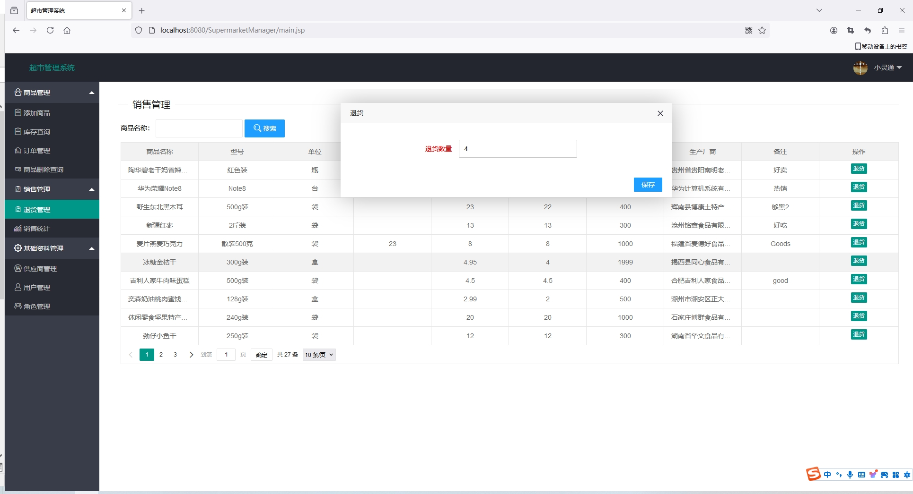

<h1 align="center">基于SSM框架的超市进销库存管理系统【带文档】</h1>

<h4> 完整代码获取地址：从戎源码网（https://armycodes.com/） </h4>
<h4> 作者微信：19941326836 QQ：605739993 QQ群：655392706 </h4>
<h4> 承接计算机毕设、Java毕业设计、Python毕业设计、深度学习、机器学习 </h4>
<h4> 选题+开题报告+任务书+程序定制+安装调试+论文+答辩ppt 一条龙服务 </h4>
<h4> 毕业设计所有选题地址：(https://github.com/Descartes007/allProject) </h4>

## 项目介绍

基于SSM框架的超市进销库存管理系统【带文档】：前端 JSP，后端 SpringMvc、Mybatis，系统角色分为：管理员、总经理、店长、财务、采购和员工，管理员在管理后台物品信息，对物品种类进行管理等。主要功能如下：

### 管理员：

- 基本操作：登录、修改密码、获取个人信息、修改个人信息
- 系统用户管理：当点击“用户管理”这一菜单的时候，会出现管理员+员工两个子菜单，可以对这两个模块进行增删改查操作
- 更多块管理：当点击“更多模块”这一菜单的时候，会出现分类信息+商品信息管理+商品销售+商品进货+客户管理+商品利润+供应商管理+通知公告这六个子菜单，可以对分这六个模块进行增删改查操作
- 商品信息管理：管理员可以对小型超市管理系统 中现有的商品信息进行增删改查
- 商品销售管理：管理员可以对小型超市管理系统 中现有的商品销售信息进行增删改查
- 客户信息管理：管理员可以对小型超市管理系统 中现有的客户信息进行增删改查
- 供应商管理：管理员对供应商进行管控

### 其他身份

- 登录：员工登录小型超市管理系统；用户对个人信息的增删改查，比如个人资料，密码修改
- 商品信息管理：员工进行商品信息的阅览，查看管理者发布的商品信息。
- 商品销售：进行商品销售查询，查看管理者发布的商品销售信息

## 环境

- <b>IntelliJ IDEA 2020.3</b>

- <b>Mysql 5.7.26</b>

- <b>Tomcat 7.0.108</b>

- <b>Maven 3.6.3</b>

- <b>JDK 1.8</b>

## 运行截图

